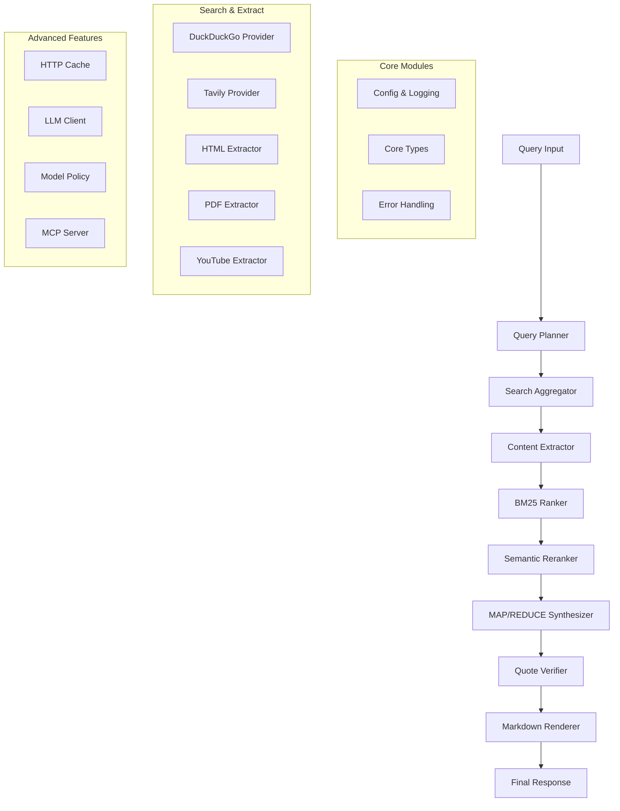

# Enhanced Research System Overview

## 🎯 Introduction

The Enhanced Research System is a comprehensive AI-powered research platform that combines web search, content extraction, intelligent ranking, synthesis, and verification into a unified pipeline. Built on top of your existing research infrastructure, it provides both backward compatibility and advanced features for complex research tasks.

## 🏗️ System Architecture



## 📁 Module Structure

### Foundation Modules (Your Implementation)
- **`config/`** - System configuration and logging
- **`core/`** - Core data types (Hit, DocChunk, Quote)
- **`planners/`** - Query planning and decomposition
- **`search/`** - Search aggregation and provider management
- **`extract/`** - Content extraction from various sources

### Advanced Modules (Integrated)
- **`rank/`** - BM25 lexical ranking + semantic reranking
- **`synth/`** - MAP/REDUCE synthesis with verification
- **`llm/`** - Enhanced Ollama client with model policies
- **`cache/`** - Intelligent HTTP caching
- **`pipeline/`** - Main orchestration and specialized agents
- **`mcp/`** - Model Context Protocol server integration
- **`tests/`** - Comprehensive test suite

## 🚀 Key Features

### Research Capabilities
- **Comprehensive Web Search** - Multi-provider search with deduplication
- **Intelligent Content Extraction** - HTML, PDF, YouTube transcript support
- **Advanced Ranking** - BM25 + semantic similarity scoring
- **MAP/REDUCE Synthesis** - Parallel processing with source attribution
- **Quote Verification** - Fact-checking with authority scoring
- **Structured Comparison** - Multi-dimensional topic analysis

### Technical Features
- **Backward Compatibility** - All existing code continues to work
- **Streaming Support** - Real-time progress events
- **Smart Caching** - HTTP caching with intelligent TTL policies
- **Error Recovery** - Robust fallback mechanisms
- **Performance Monitoring** - Detailed statistics and health checks
- **MCP Integration** - Full Model Context Protocol support

## 🔄 Backward Compatibility

### Existing API Unchanged
Your existing endpoints continue to work exactly as before:
```python
# This still works exactly the same
response_data = research_agent(query, model)
result = fact_check_agent(claim, model)
comparison = comparative_research_agent(topics, model)
```

### Enhanced with Optional Features
Add advanced features by setting optional parameters:
```python
# Enable advanced pipeline
response_data = research_agent(query, model, use_advanced=True)

# Use async version for FastAPI
result = await async_research_agent(query, model, enable_streaming=True)
```

## 📊 Performance Improvements

### Caching Benefits
- **Reduced API Calls** - Smart HTTP caching reduces redundant requests
- **Faster Responses** - Cached content serves instantly
- **Cost Savings** - Fewer external API calls

### Parallel Processing
- **Concurrent Search** - Multiple search providers simultaneously
- **Parallel Synthesis** - MAP phase processes chunks concurrently
- **Batch Operations** - Efficient handling of multiple requests

### Intelligent Resource Management
- **Model Selection** - Automatic selection of appropriate models per task
- **Memory Optimization** - Efficient chunk processing and cleanup
- **Connection Pooling** - Reused HTTP connections for better performance

## 🛠️ Integration Points

### With Your Existing System
- **Uses Your Core Types** - Built on Hit, DocChunk, Quote from `core/types.py`
- **Extends Your Search** - Integrates with existing search aggregator
- **Leverages Your Extraction** - Uses your content extraction pipeline
- **Maintains Your API** - All endpoints work as before

### With External Services
- **Ollama Integration** - Enhanced client with fallback support
- **Search Providers** - DuckDuckGo, Tavily, extensible to others
- **Content Sources** - Websites, PDFs, YouTube, extensible architecture

## 🔧 Configuration Options

### Basic Configuration
```python
# Simple setup (backward compatible)
research_agent_instance = get_enhanced_research_agent(
    search_engine="duckduckgo",
    ollama_url="http://ollama:11434",
    default_model="mistral",
    max_search_results=20
)
```

### Advanced Configuration
```python
# Advanced setup with all features
research_agent_instance = get_enhanced_research_agent(
    search_engine="tavily",  # If API key available
    ollama_url="http://ollama:11434",
    default_model="mistral",
    max_search_results=20,
    enable_advanced_features=True  # Enables caching, verification, etc.
)
```

## 📈 Usage Patterns

### Simple Research (Backward Compatible)
```python
# Existing pattern - no changes needed
result = research_agent("What is machine learning?", "mistral")
analysis = result["analysis"]
sources = result["sources"]
```

### Advanced Research
```python
# New advanced pattern with verification and streaming
response = await async_research_agent(
    query="Compare renewable energy technologies",
    model="mistral", 
    enable_streaming=True
)
```

### Fact Checking
```python
# Enhanced fact-checking with authority scoring
result = await async_fact_check_agent(
    claim="Solar panels are 95% efficient",
    model="mistral"
)
```

### Structured Comparison
```python
# Multi-dimensional comparison analysis
comparison = await async_comparative_research_agent(
    topics=["Solar Power", "Wind Power", "Nuclear Power"],
    context="renewable energy comparison",
    model="mistral"
)
```

## 🎯 Use Cases

### Academic Research
- Literature reviews with source verification
- Fact-checking academic claims
- Comparative analysis of theories or methodologies

### Business Intelligence
- Market research and competitor analysis
- Technology comparison and evaluation
- Industry trend analysis

### Content Creation
- Research-backed article writing
- Fact-checking and verification
- Multi-perspective topic exploration

### AI Agent Integration
- **MCP Server** - Expose research as tools for other AI systems
- **Vision Interface** - Research capabilities for multimodal AI
- **Automation** - Integrate with workflows and pipelines

## 🔍 Quality Assurance

### Verification Features
- **Quote Attribution** - All quotes linked to original sources
- **Authority Scoring** - Source credibility assessment
- **Fact Verification** - Claims checked against evidence
- **Confidence Metrics** - Reliability scores for all findings

### Error Handling
- **Graceful Degradation** - Falls back to simpler methods on failure
- **Comprehensive Logging** - Detailed error reporting and debugging
- **Recovery Mechanisms** - Automatic retry with exponential backoff

## 🚀 Getting Started

### 1. Install Dependencies
```bash
pip install -r requirements.txt
```

### 2. Basic Usage
```python
from research import quick_research

# Simple research query
result = await quick_research("What are the benefits of solar energy?")
print(result)
```

### 3. Advanced Usage
```python
from research import AdvancedResearchAgent, ResearchConfig

# Configure advanced research
config = ResearchConfig(
    max_search_results=25,
    enable_verification=True,
    enable_reranking=True
)

agent = AdvancedResearchAgent(config)
result = await agent.research("Compare solar vs wind energy")
```

## 📚 Next Steps

- **[API Documentation](api/research-endpoints.md)** - Complete API reference
- **[Developer Guide](developer-guide.md)** - Technical implementation details  
- **[Configuration Guide](configuration.md)** - Setup and customization
- **[MCP Integration](mcp-integration.md)** - Model Context Protocol usage
- **[Examples](examples/)** - Code samples and tutorials

## 🆘 Support

- **[Troubleshooting Guide](troubleshooting.md)** - Common issues and solutions
- **Health Check Endpoint** - `/api/research/health` for system status
- **Statistics Endpoint** - `/api/research/stats` for performance metrics