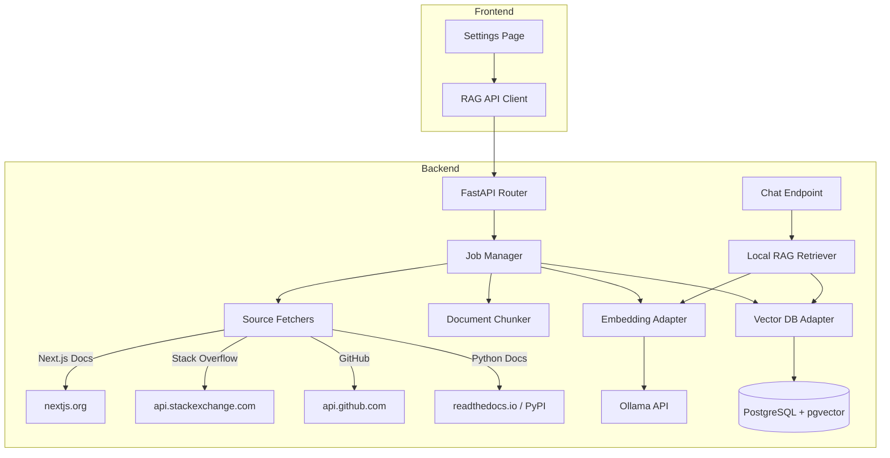

# Local RAG Corpus Manager

This module provides a local RAG (Retrieval-Augmented Generation) corpus manager for Harvis. It allows users to index content from various sources and use that context to enhance LLM responses.

## Architecture



## Components

### Backend (`python_back_end/rag_corpus/`)

| File | Description |
|------|-------------|
| `__init__.py` | Module exports |
| `job_manager.py` | Background job orchestration with status tracking |
| `source_fetchers.py` | Fetchers for Next.js docs, Stack Overflow, GitHub, Python docs |
| `chunker.py` | Document chunking with metadata preservation |
| `embedding_adapter.py` | Ollama embedding API with HuggingFace fallback |
| `vectordb_adapter.py` | pgvector operations and retriever |
| `routes.py` | FastAPI endpoints for RAG management |

### Frontend (`front_end/newjfrontend/`)

| File | Description |
|------|-------------|
| `app/settings/page.tsx` | Settings UI for source selection and job management |
| `lib/rag.ts` | TypeScript API client for RAG endpoints |
| `components/ui/checkbox.tsx` | Checkbox UI component |

## Available Sources

| Source | Description | Configuration |
|--------|-------------|---------------|
| `nextjs_docs` | Official Next.js documentation | Keywords, extra URLs |
| `stack_overflow` | Stack Overflow Q&A | Tags (keywords) |
| `github` | GitHub repositories | Repo URLs, keywords |
| `python_docs` | Python library documentation | Library names (e.g., `requests`, `pandas`, `fastapi`) |

## API Endpoints

### `POST /api/rag/update-local`
Start a background job to update the local RAG corpus.

**Request:**
```json
{
  "sources": ["nextjs_docs", "stack_overflow", "github", "python_docs"],
  "keywords": ["routing", "api"],
  "extra_urls": ["https://github.com/vercel/next.js"],
  "python_libraries": ["requests", "pandas", "fastapi"]
}
```

**Response:**
```json
{
  "job_id": "abc123",
  "status": "accepted",
  "message": "Job started for sources: nextjs_docs, python_docs"
}
```

### `GET /api/rag/jobs/{job_id}`
Get status of a specific job.

### `GET /api/rag/jobs`
List recent jobs.

### `GET /api/rag/sources`
Get available sources and indexed document counts.

### `POST /api/rag/rebuild`
Rebuild (clear + re-index) a specific source.

### `DELETE /api/rag/sources/{source}`
Clear all documents from a source.

### `GET /api/rag/health`
Check health of RAG services.

### `GET /api/rag/config`
Get current RAG configuration.

## Data Flow

1. **User Action**: User selects sources and clicks "Start Update" in Settings
2. **Job Creation**: Backend creates a job and returns job ID immediately
3. **Background Execution**:
   - Job manager fetches content from selected sources
   - Documents are chunked into ~1000 character segments with overlap
   - Chunks are persisted to disk in RAG directory
   - Embeddings are generated via Ollama
   - Vectors are upserted to pgvector
4. **Chat Integration**:
   - When user sends a message, query is embedded
   - Similar documents are retrieved from vector DB
   - Context is injected into system prompt
   - LLM generates response with relevant context

## Configuration

Environment variables:

| Variable | Default | Description |
|----------|---------|-------------|
| `RAG_CORPUS_DIR` | `/app/rag_corpus_data` | Directory for persisting raw chunks |
| `OLLAMA_URL` | `http://ollama:11434` | Ollama server URL |
| `RAG_EMBEDDING_MODEL` | `nomic-embed-text` | Embedding model (768 dimensions) |

## Database Schema

The module creates a `local_rag_corpus` table in PostgreSQL:

```sql
CREATE TABLE local_rag_corpus (
    id VARCHAR(64) PRIMARY KEY,
    embedding vector(768),
    text TEXT NOT NULL,
    metadata JSONB DEFAULT '{}',
    source VARCHAR(128),
    created_at TIMESTAMPTZ DEFAULT NOW(),
    updated_at TIMESTAMPTZ DEFAULT NOW()
);

CREATE INDEX idx_local_rag_corpus_source ON local_rag_corpus(source);
CREATE INDEX idx_local_rag_corpus_embedding ON local_rag_corpus USING hnsw (embedding vector_cosine_ops);
```

## Usage

### From the UI

1. Navigate to Settings (sidebar → Settings)
2. Select sources to index (Next.js Docs, Stack Overflow, GitHub)
3. Optionally add keyword filters
4. Click "Start Update"
5. Monitor progress in the job status panel
6. Use "Rebuild" or "Clear" buttons to manage indexed sources

### From Code

```python
from rag_corpus import JobManager, EmbeddingAdapter, VectorDBAdapter

# Initialize
job_manager = JobManager(db_pool, "/path/to/rag/dir")

# Create and run job
job_id = await job_manager.create_job(
    sources=["nextjs_docs"],
    keywords=["app router"]
)
await job_manager.run_job_async(job_id)

# Query the corpus
from rag_corpus import LocalRAGRetriever

retriever = LocalRAGRetriever(vectordb_adapter, embedding_adapter)
results = await retriever.retrieve("How do I use server actions?", k=5)
```

## Extending

### Adding a New Source

1. Create a new fetcher class in `source_fetchers.py`:

```python
class MyNewSourceFetcher(BaseFetcher):
    SOURCE_NAME = "my_source"
    
    async def fetch(self, keywords, extra_urls) -> List[RawDocument]:
        # Fetch and return documents
        pass
```

2. Register in `get_fetcher()` function
3. Add to `SOURCE_CONFIG` in Settings page
4. Update API route validation

### Custom Chunking

Create a subclass of `DocumentChunker` for specialized content:

```python
class MyCustomChunker(DocumentChunker):
    def chunk_document(self, doc: RawDocument) -> List[Chunk]:
        # Custom chunking logic
        pass
```
